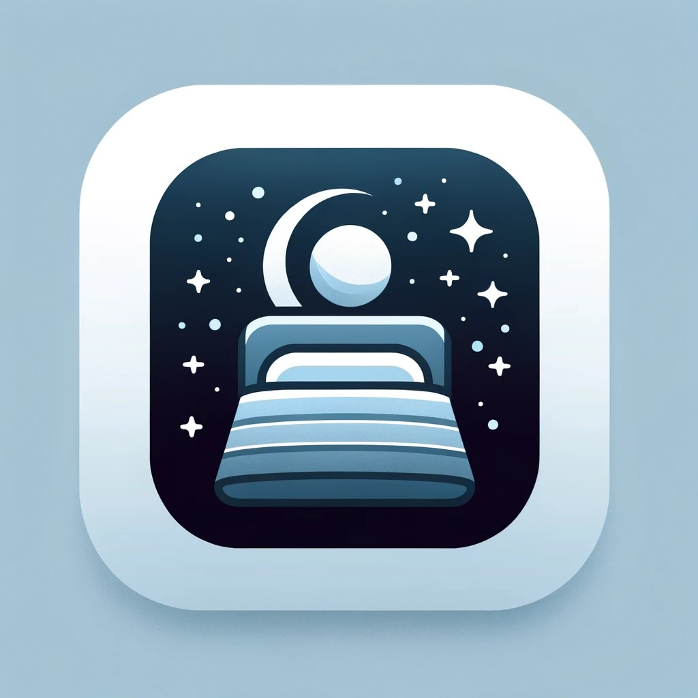
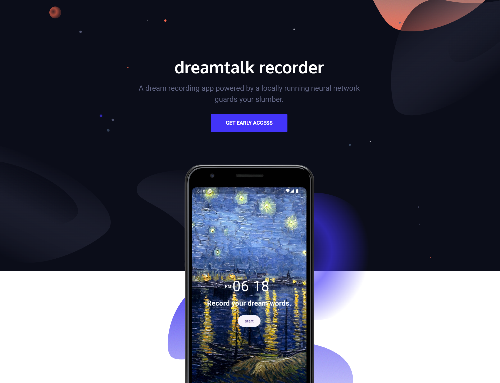
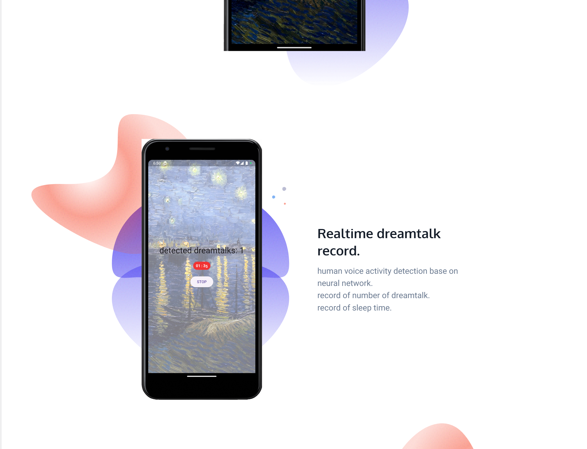
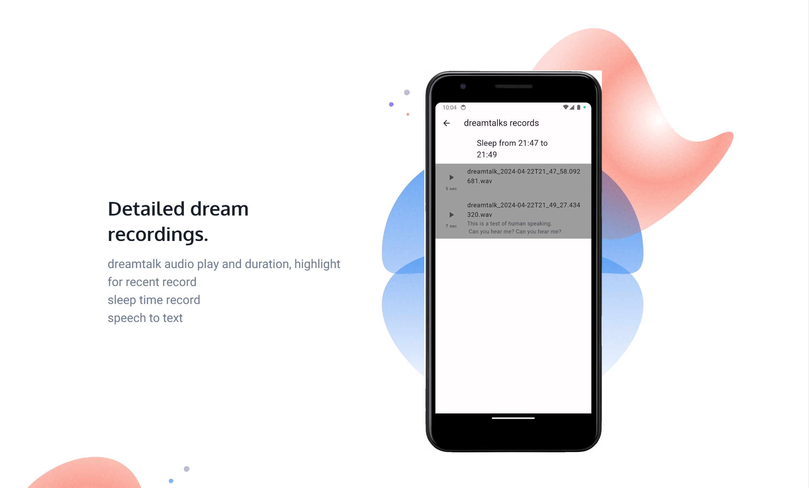
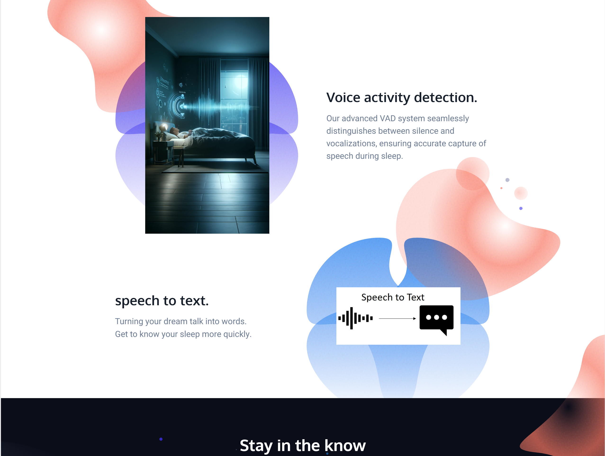

# sleep guardian

This application is designed to recognise and record dream words, users can easily review their own own dream words by playing the recording or text transcription.
### app demo

### landing page

## Use this README File 

Use this section to show us what your Mobile App is about.   Include a Screenshot to the App, link to the various frameworks you've used. Include your presentation video here that shows off your Mobile App.   Emojis are also fun to include 📱 😄

Look at some other Flutter Apps online and see how they use there README File.  Good examples are:

- https://github.com/miickel/flutter_particle_clock
- https://github.com/Tarikul711/flutter-food-delivery-app-ui    
- https://github.com/mohak1283/Instagram-Clone

## Include A Section That Tells Developers How To Install The App

Include a section that gives intructions on how to install the app or run it in Flutter.  What versions of the plugins are you assuming?  Maybe define a licence

##  Contact Details

Having Contact Details is also good as it shows people how to get in contact with you if they'd like to contribute to the app. 
